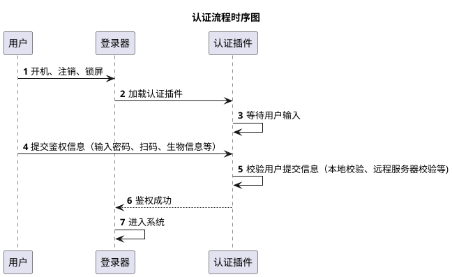
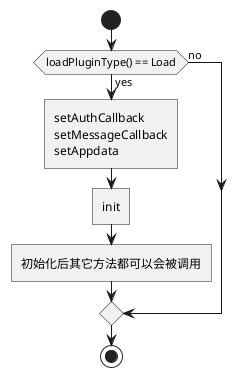

# 概述

本文档是针对 UOS 登录器插件给出开发指南，目的是为了让开发人员了解如何在 UOS 登录器上增加一种自定义认证方式，对插件接口做了详细说明以及实战练习。

# 认证插件可以做什么？

UOS 提供了丰富了登录方式：密码、UKey、指纹、人脸、虹膜等，这些登录方式是在登录器内部处理的，想要实现其它的登录方式（比如二维码）又不想与 UOS 的登录器有过多的耦合，那么就可以使用认证插件的方式来实现。只需根据认证插件的接口来开发一个动态库，即可在登录器上增加一种自定义登录方式。

## 认证流程

登录器在开机/注销/锁屏后会加载认证插件，并发起认证，然后等待插件返回认证结果。用户鉴权通过后，插件发送认证成功给登录器，后面的如何进入系统由登录器来处理。在整个过程中，插件只需要关注自身的认证逻辑，把认证结果发送到登录器后插件的工作就完成了。



## 术语说明

登录器：即 UOS 系统中的登录/锁屏软件。

登录是指用户开机、重启、注销后看到的 UI 界面，进程名称为 lightdm-deepin-greeter。

锁屏是用户按下 Meta+L 快捷键（没有修改快捷键的情况下），或者在电源界面选择“锁定”后看到的 UI 界面，进程名为 dde-lock。

# 接口使用

## 环境配置

安装开发包 dde-session-shell-dev，安装完成后在 /usr/include/dde-session-shell/ 路径会有三个插件相关的头文件：base_module_interface.h 、login_module_interface.h、login_module_interface_v2.h，开发时使用 login_module_interface_v2.h 即可，有更完备的接口和功能。

认证插件需要使用 Qt 框架，根据实际需求搭建 Qt 开发环境即可，这里不再赘述。

## 数据结构说明

下面是开发认证插件时可能会用到的数据结构，可以在开发时作为工具文档使用。

### ModuleType

**说明：** 插件类型

**类型：** 枚举

| 字段      | 说明     | 备注                                                                   |
| :-------- | :------- | :--------------------------------------------------------------------- |
| LoginType | 认证插件 | 认证插件默认使用此字段                                                 |
| TrayType  | 托盘插件 | 展示在登录器右下方控制区域的插件（例如网络，认证插件不用关注这个类型） |

### AuthCallbackData

**说明：** 认证插件需要传回的数据

**类型：** 结构体

| 字段    | 数据类型 | 说明     | 必填 | 备注             |
| :------ | :------- | :------- | :--- | :--------------- |
| result  | int      | 认证结果 | 是   | 1 成功，其他失败 |
| account | string   | 账户     | 否   | 用户账号         |
| token   | string   | 通行令牌 | 否   | 用户密码等       |
| message | string   | 提示消息 | 否   |                  |
| json    | string   | 冗余字段 | 否   | 暂时没有使用     |

### LoginCallBack

**说明：** 回调函数以及登录器的回传指针

**类型：** 结构体

| 字段                | 类型               | 说明             | 备注                                   |
| :------------------ | :----------------- | :--------------- | :------------------------------------- |
| app_data            | void\*             | 登录器的回传指针 | 插件无需关注，只需在回调函数中传入即可 |
| authCallbackFun     | AuthCallbackFun    | 认证回调函数     | 用于认证完成后通知登录器               |
| messageCallbackFunc | MessageCallbackFun | 消息回调函数     | 用于主动与登录器交互                   |

### AppType

**说明：** 发起认证的应用类型

**类型：** 枚举

| 字段  | 说明   | 备注                                          |
| :---- | :----- | :-------------------------------------------- |
| None  | 异常值 | 如果为 None 则说明出现异常                    |
| Login | 登录   | 二进制文件为：/usr/bin/lightdm-deepin-greeter |
| Lock  | 锁屏   | 二进制文件为：/usr/bin/dde-lock               |

### LoadType

**说明：** 模块加载的类型

**类型：** 枚举

| 字段    | 说明       | 备注 |
| :------ | :--------- | :--- |
| Load    | 加载插件   |      |
| NotLoad | 不加载插件 |      |

### AuthObjectType

**说明：** 模块加载的类型

**类型：** 枚举

| 字段               | 说明       | 备注 |
| :----------------- | :--------- | :--- |
| LightDM            | 显示管理器 |      |
| DeepinAuthenticate | 不加载插件 |      |

### AuthType

**说明：** 认证类型

**类型：** 枚举

| 字段    | 说明   | 备注 |
| :------ | :----- | :--- |
| 0       | 默认   |      |
| 1 << 0  | 密码   |      |
| 1 << 1  | 指纹   |      |
| 1 << 2  | 人脸   |      |
| 1 << 3  | AD 域  |      |
| 1 << 4  | UKey   |      |
| 1 << 5  | 指静脉 |      |
| 1 << 6  | 虹膜   |      |
| 1 << 7  | PIN    |      |
| 1 << 29 | PAM    |      |
| 1 << 30 | 自定义 |      |
| -1      | ALL    |      |

### AuthState

**说明：** 认证状态

**类型：** 枚举

| 字段 | 说明       | 备注                                                                                |
| :--- | :--------- | :---------------------------------------------------------------------------------- |
| -1   | 默认       |                                                                                     |
| 0    | 成功       | 此次认证的最终结果                                                                  |
| 1    | 失败       | 此次认证的最终结果                                                                  |
| 2    | 取消       | 当认证没有给出最终结果时，调用 End 会出发 Cancel 信号                               |
| 3    | 超时       | 一些认证设备会有超时状态的设定                                                      |
| 4    | 错误       |                                                                                     |
| 5    | 验证中     |                                                                                     |
| 6    | 设备异常   | 当前认证会被 End                                                                    |
| 7    | 设备提示   |                                                                                     |
| 8    | 认证已启动 | 调用 Start 之后，每种成功开启都会发送此信号                                         |
| 9    | 认证已结束 | 调用 End 之后，每种成功关闭的都会发送此信号，当某种认证类型被锁定时，也会触发此信号 |
| 10   | 认证已锁定 | 认证类型已锁定，表示认证类型不可用（从安全角度考虑，失败次数过多时会导致这种情况）  |
| 11   | 设备恢复   | 需要调用 Start 重新开启认证，对应 AS_Exception                                      |
| 12   | 认证解锁   | 认证类型解除锁定，表示可以继续继续使用此认证类型开始认证了                          |

## 接口说明

在开发认证插件时需要以 public 方式继承LoginModuleInterfaceV2，并实现以下接口。

### BaseModuleInterface

#### type

**函数定义：**

```c++
virtual ModuleType type() const = 0
```

**说明：** 插件的类型。

**入参：** 无

**返回值：**

| 类型       | 说明       | 备注                       |
| :--------- | :--------- | :------------------------- |
| ModuleType | 插件的类型 | 认证插件必须返回 LoginType |

**必须实现：** 否；LoginModuleInterface 已经实现了这个函数，默认返回 LoginType。

#### init

**函数定义：**

```c++
virtual void init() = 0
```

**说明：** 界面相关的初始化，插件在非主线程加载，故界面相关的初始化需要放在这个方法里，由主程序调用并初始化。

**入参：** 无

**返回值：** 无

**必须实现：** 是

#### key

**函数定义：**

```c++
virtual QString key() const = 0
```

**说明：** 唯一值，用于与其它模块区分。

**入参：** 无

**返回值：**

| 类型   | 说明     | 备注                     |
| :----- | :------- | :----------------------- |
| string | 唯一编码 | 传入与项目相关的命名即可 |

**必须实现：** 是

#### icon

**函数定义：**

```c++
virtual QString icon() const
```

**说明：**
当认证因子不止一种时，登录器会显示认证类型切换组件，它是由一个按钮组（Button Group）组成的，此函数返回的图标会展示在“认证插件切换按钮”上面。

**入参：** 无

**返回值：**

| 类型   | 说明           | 备注                                                                                                                                         |
| :----- | :------------- | :------------------------------------------------------------------------------------------------------------------------------------------- |
| string | 认证插件的图标 | 可以返回图标的绝对路径（加载方式为 QIcon(“absolute path”)），也可以返回系统图标的名称(加载方式为 QIcon::fromTheme(“system icon name”))。 |

**必须实现：** 否

#### content

**函数定义：**

```c++
virtual QWidget* content() const = 0
```

**说明：**
登录器会将返回的 QWidget* 内容展示出来，可以展示提示信息或者二维码等，具体内容插件可以自由设计。需要注意的是，登录器的展示的版面有限，高度最好不要超过 500 像素，宽度不超过 900 像素。

**入参：** 无

**返回值：**

| 类型      | 说明                   | 备注                               |
| :-------- | :--------------------- | :--------------------------------- |
| QWidget\* | 插件想要显示的窗口指针 | 由登录器托管，插件不要释放这个指针 |

**必须实现：** 是

#### loadPluginType

**函数定义：**

```c++
virtual LoadType loadPluginType() const
```

**说明：**
登录器在加载插件的时候会调用这个接口，如果返回 Load，那么登录会加载插件，返回其它则不会加载插件。 非全平台或全架构的插件需要重新实现这个接口，根据实际情况处理。

**入参：** 无

**返回值：**

| 类型     | 说明                  | 备注 |
| :------- | :-------------------- | :--- |
| LoadType | 见 `LoadType`的说明 | -    |

**必须实现：** 是

#### setAppData

**函数定义：** 无

```c++
virtual LoadType setAppdata(void*) const
```

**说明：**
设置登录器的回调指针，插件需要保存指针，在使用回调函数的时候回传给登录器。如果要使用回调函数，则必须实现此函数。
函数可能会被重复调用，插件只需要保证回传的时候是最后一次设置的即可。

**入参：** 无

| 类型   | 说明 | 备注 |
| :----- | :--- | :--- |
| void\* | -    | -    |

**返回值：** 无

**必须实现：** 否

#### setMessageCallback

**函数定义：**

```c++
virtual void setMessageCallback(MessageCallbackFunc *) = 0
```

**说明：** 设置回调函数，会在init函数之前调用。

**入参：**

| 类型                  | 说明                                 | 备注 |
| :-------------------- | :----------------------------------- | :--- |
| MessageCallbackFunc\* | 详见 `MessageCallbackFunc`类型说明 |      |

**返回值：** 无

**必须实现：** 否

#### MessageCallbackFun

**函数定义：**

```c++
QString (*)(const QString &, void *)
```

**说明：**
消息回调函数，用于向登录器发起通讯的场景

**入参：**

| 类型   | 说明                              | 备注                                    |
| :----- | :-------------------------------- | :-------------------------------------- |
| string | 发送给登录器的 json 格式数据      | json 数据的具体内容详见下面数据协议部分 |
| void\* | 即 LoginCallBack 的 app_data 字段 |                                         |

**返回值：**

| 类型   | 说明                         | 备注 |
| :----- | :--------------------------- | :--- |
| string | 发送给登录器的 json 格式数据 |      |

**数据协议：**

默认返回的数据:

| 字段    | 类型   | 说明             |
| :------ | :----- | :--------------- |
| Code    | int    | 0 成功，其他失败 |
| Message | string | 提示消息         |

例：

```json
{
  "Code": 0,
  "Message": "Success"
}
```

1. 获取属性

请求：

| 字段    | 类型   | 值                        | 说明                                                                                                                                       |
| :------ | :----- | :------------------------ | :----------------------------------------------------------------------------------------------------------------------------------------- |
| CmdType | string | "GetProperties"           |                                                                                                                                            |
| Data    | array  | ["AppType","CurrentUser"] | [值]列中展示的是目前支持的值,传入其它值无效。`<br>`根据 api 版本号来判断支持哪些字段：`<br>`since api-2.0.0 ("AppType", "CurrentUser") |

例：

```json
{
  "CmdType": "GetProperties",
  "Data": ["AppType", "CurrentUser"]
}
```

返回值：

| 字段                  | 类型   | 说明                  |
| :-------------------- | :----- | :-------------------- |
| Code                  | int    | 0 成功，其他失败      |
| Message               | string | 提示消息              |
| Data                  | object | -                     |
| Data.AppType          | int    | 详见 AppType 枚举说明 |
| Data.CurrentUser      | object | 当前用户信息          |
| Data.CurrentUser.Name | string | 当前用户的用户名      |

例：

```json
{
  "Code": 0,
  "Message": "Success",
  "Data": {
    "AppType": 2,
    "CurrentUser": {
      "Name": "uos"
    }
  }
}
```

#### message

**函数定义：**

```c++
virtual QString message(const QString &)
```

**说明：**
登录器主动向认证插件发起通讯，一般用于获取插件信息或者给插件提供信息，入参和返回值都是 json 格式的字符串。

**入参：**

| 类型    | 说明            | 备注 |
| :------ | :-------------- | :--- |
| QString | json 格式字符串 |      |

**返回值：**

| 类型    | 说明            | 备注 |
| :------ | :-------------- | :--- |
| QString | json 格式字符串 |      |

**必须实现：** 否

**数据协议：**

默认返回的数据:

| 字段    | 类型   | 说明             |
| :------ | :----- | :--------------- |
| Code    | int    | 0 成功，其他失败 |
| Message | string | 提示消息         |

例：

```json
{
  "Code": 0,
  "Message": "Success"
}
```

1. **用户发生变化(CurrentUserChanged)**
   说明：程序启动或者切换用户的时候登录器会主动发送此消息，告知认证插件当前正在认证的用户是谁。

请求：

| 字段      | 类型   | 值                 | 说明             |
| :-------- | :----- | :----------------- | :--------------- |
| CmdType   | string | CurrentUserChanged |                  |
| Data      | object | -                  |                  |
| Data.Name | string | -                  | 当前用户的用户名 |

示例：

```json
{
  "CmdType": "CurrentUserChanged",
  "Data": {
    "Name": "uos"
  }
}
```

返回值：默认数据。

2. **获取配置(GetConfigs)**
   支持认证插件来控制登录器其它的 UI 控件。

请求：

| 字段    | 类型   | 值             | 说明 |
| :------ | :----- | :------------- | :--- |
| CmdType | string | “GetConfigs” |      |

示例：

```json
{
  "CmdType": "GetConfigs"
}
```

返回值：

| 字段                    | 类型   | 必填项 | 说明                                                                                                                                                                                                                                                                                                                                                                                    |
| :---------------------- | :----- | :----- | :-------------------------------------------------------------------------------------------------------------------------------------------------------------------------------------------------------------------------------------------------------------------------------------------------------------------------------------------------------------------------------------- |
| Code                    | int    | 否     | 0 成功，其他失败                                                                                                                                                                                                                                                                                                                                                                        |
| Message                 | string | 否     | 提示消息                                                                                                                                                                                                                                                                                                                                                                                |
| Data                    | object | 是     |                                                                                                                                                                                                                                                                                                                                                                                         |
| Data.ShowAvatar         | bool   | 否     | 是否显示用户头像                                                                                                                                                                                                                                                                                                                                                                        |
| Data.ShowUserName       | bool   | 否     | 是否显示用户名                                                                                                                                                                                                                                                                                                                                                                          |
| Data.ShowSwitchButton   | bool   | 否     | 是否显示认证类型切换按钮                                                                                                                                                                                                                                                                                                                                                                |
| Data.ShowLockButton     | bool   | 否     | 是否显示解锁按钮                                                                                                                                                                                                                                                                                                                                                                        |
| Data.DefaultAuthLevel   | int    | 否     | 0：如果获取到上次认证成功的类型，则默认使用上次登录成功的类型，否则根据系统默认的顺序来选择。`<br>`1：如果获取到上次认证成功的类型，则默认使用上次登录成功的类型，否则使用插件认证。`<br>`2：无论是否可以获取到上次认证成功的类型，都默认选择插件验证。`<br>`默认为 1                                                                                                             |
| Data.SupportDefaultUser | bool   | 否     | 插件是否支持默认用户的登录。默认用户：即当前没有指定用户，默认用户为"..."，一般在域管和服务器环境下会出现。`<br>`支持的场景：用户在登录界面扫描二维码，认证成功后插件得知是扫码人员的身份，与系统中的人员进行比对，将人员身份和认证结果返回给登录器，登录器可以登录此用户。`<br>`不支持的场景：必须先知道当前验证人员的身份，才能进行验证。`<br>`插件不处理此接口，则默认为支持。 |

    示例：

```json
{
  "Code": 0,
  "Message": "Success",
  "Data": {
    "ShowAvatar": true,
    "ShowUserName": true,
    "ShowSwitchButton": true,
    "ShowLockButton": false,
    "DefaultAuthLevel": 1
  }
}
```

3. **认证开始（StartAuth）**
   登陆界面会有两次开启验证，一次是 deepin-authenticate 服务，还有一次是 lightdm，插件需要等到这两个验证都开启后再发送验证结果。
   锁屏界面只有 deepin-authenticate 会发起一次验证，插件需要等 deepin-authenticate 开启验证后再发送验证结果。
   这两种验证类型都会在插件加载后的很短的一段时间后开启验证（1s 以内），主要是处理指纹一键登录的需求。如果插件发送验证结果的时间较晚（比如扫码、输入验证码等）则无需关心此消息。

请求：

| 字段                | 类型   | 值        | 说明                        |
| :------------------ | :----- | :-------- | :-------------------------- |
| CmdType             | string | StartAuth |                             |
| Data                | object |           |                             |
| Data.AuthObjectType | int    |           | 见 `AuthObjectType`的说明 |

示例：

```json
{
  "CmdType": "StartAuth",
  "Data": {
    "AuthObjectType": 1
  }
}
```

返回值：默认数据。

4. **认证状态（AuthState）**
   当前登录器的认证状态

请求：

| 字段           | 类型   | 值          | 说明                   |
| :------------- | :----- | :---------- | :--------------------- |
| CmdType        | string | "AuthState" |                        |
| Data           | object |             |                        |
| Data.AuthType  | int    |             | 见 `AuthType`的说明  |
| Data.AuthState | int    |             | 见 `AuthState`的说明 |

示例：

```json
{
    "CmdType": "AuthState",
    "Data": {
       "AuthType": 1，
       "AuthState": 0

    }
}
```

返回值：默认数据。

5. **限制信息（LimitsInfo）**
   所有认证类型的限制信息

请求：

| 字段               | 类型   | 值           | 说明                      |
| :----------------- | :----- | :----------- | :------------------------ |
| CmdType            | string | "LimitsInfo" |                           |
| Data               | array  |              |                           |
| Object.Flag        | int    |              | 认证类型，见 `AuthType` |
| Object.Locked      | bool   |              | 是否锁定                  |
| Object.MaxTries    | int    |              | 可尝试的次数              |
| Object.NumFailures | int    |              | 已错误次数                |
| Object.UnlockSecs  | int    |              | 还剩多久解锁              |
| Object.UnlockTime  | string |              | 解锁时间                  |

示例：

```json
{
  "CmdType": "LimitsInfo",
  "Data": [
    {
      "Flag": 1,
      "Locked": false,
      "MaxTries": 5,
      "NumFailures": 0,
      "UnlockSecs": 0,
      "UnlockTime": "0001-01-01T00:00:00Z"
    },
    {
      "Flag": 2,
      "Locked": false,
      "MaxTries": 3,
      "NumFailures": 0,
      "UnlockSecs": -1,
      "UnlockTime": "0001-01-01T00:00:00Z"
    }
  ]
}
```

返回值：默认数据。

6. **是否启用插件**
   登录器在开始验证的时候会向插件发起此请求，插件自行决定现在是否要启用插件，登录器默认插件是启用的。

请求：

| 字段    | 类型   | 值                | 说明 |
| :------ | :----- | :---------------- | :--- |
| CmdType | string | "IsPluginEnabled" |      |

示例：

```json
{
  "CmdType": "IsPluginEnabled"
}
```

返回值：

| 字段    | 类型   | 必填项 | 说明             |
| :------ | :----- | :----- | :--------------- |
| Code    | int    | 否     | 0 成功，其他失败 |
| Message | string | 否     | 提示消息         |
| Data    | bool   | 是     | 默认为 true      |

示例：

```json
{
  "Code": 0,
  "Message": "Success",
  "Data": {
    "IsPluginEnabled": true
  }
}
```

### LoginModuleInterfaceV2

#### setAuthCallback

**函数定义：**

```c++
virtual void setAuthCallback(AuthCallbackFunc *) = 0
```

**说明：** 设置回调函数，会在init函数之前调用。

**入参：**

| 类型               | 说明                              | 备注 |
| :----------------- | :-------------------------------- | :--- |
| AuthCallbackFunc\* | 详见 `AuthCallbackFunc`类型说明 |      |

**返回值：** 无

**必须实现：** 是

#### AuthCallbackFun

**函数定义：**

```c++
void (*)(const AuthCallbackData *, void *)
```

**说明：** 认证回调函数，用于插件返回认证的状态、结果等

**入参：**

| 类型               | 说明                              | 备注 |
| :----------------- | :-------------------------------- | :--- |
| AuthCallbackData\* | 认证相关信息                      |      |
| void\*             | 即 LoginCallBack 的 app_data 字段 |      |

**返回值：** 无

#### reset

**函数定义：**

```c++
virtual void reset() = 0
```

**说明：**
插件需要在这个方法中重置UI和验证状态，通常验证开始之前登录器会调用这个方法，但是不保证每次验证前都会调用。插件必须实现这个函数，并在函数内重置之前的验证结果，避免将以前的结果应用在当前认证中。

**入参：** 无

**返回值：** 无

**必须实现：** 是

### 初始化接口调用

认证插件初始化时接口调用顺序如下：



## 编程实例

### CMakeLists.txt

```cmake
# 设置运行此配置所需的 cmake 的最低版本
cmake_minimum_required(VERSION 3.11)

# 使用 set 命令设置一个变量
set(PLUGIN_NAME login-basic)

# 设置项目名称
project(${PLUGIN_NAME})

# 启用 qt moc 的支持
set(CMAKE_AUTOMOC ON)
# 启用 qrc 资源文件的支持
set(CMAKE_AUTORCC ON)

# 指定所有源码文件
# 使用了 cmake 的 file 命令，递归查找项目目录下所有头文件和源码文件
# 并将结果放入 SRCS 变量中，方便后续取用
file(GLOB_RECURSE SRCS "*.h" "*.cpp")

# 指定要用到的库
# 使用了 cmake 的 find_package 命令，查找库 Qt5Widgets 等，
# REQUIRED 参数表示如果没有找到则报错
# find_package 命令在找到并加载指定的库之后会设置一些变量
# 常用的有：
# <库名>_FOUND          是否找到（Qt5Widgets_FOUND）
# <库名>_DIR            在哪个目录下找到的（Qt5Widgets_DIR）
# <库名>_INCLUDE_DIRS   有哪些头文件目录（Qt5Widgets_INCLUDE_DIRS）
# <库名>_LIBRARIES      有哪些库文件（Qt5Widgets_LIBRARIES）
find_package(Qt5Widgets REQUIRED)
find_package(DtkWidget REQUIRED)
find_package(DdeSessionShell REQUIRED)

# find_package 命令还可以用来加载 cmake 的功能模块
# 并不是所有的库都直接支持 cmake 查找的，但大部分都支持了 pkg-config 这个标准，
# 因此 cmake 提供了间接加载库的模块：FindPkgConfig， 下面这行命令表示加载 FindPkgConfig 模块，
# 这个 cmake 模块提供了额外的基于 “pkg-config” 加载库的能力
# 执行下面的命令后后会设置如下变量，不过一般用不到：
# PKG_CONFIG_FOUND            pkg-config 可执行文件是否找到了
# PKG_CONFIG_EXECUTABLE       pkg-config 可执行文件的路径
# PKG_CONFIG_VERSION_STRING   pkg-config 的版本信息
find_package(PkgConfig REQUIRED)

# add_definitions 命令用于声明/定义一些编译/预处理参数
add_definitions("${QT_DEFINITIONS} -DQT_PLUGIN")

# 新增一个编译目标
# 这里使用命令 add_library 来表示本项目要生成一个库文件目标，
# 类似的还有命令 add_executable 添加一个可执行二进制目标，甚至 add_custom_target(使用较少) 添加自定义目标
# SHARED 表示生成的库应该是动态库，
# 变量 ${PLUGIN_NAME} 和 ${SRCS} 都是前面处理好的，
# 另外 qrc 资源文件也应该追加在后面以编译进目标中。
add_library(${PLUGIN_NAME} SHARED ${SRCS})

# 设置目标的生成位置，这里表示生成在执行 make 的目录,
# 另外还有很多可用于设置的属性，可查阅 cmake 文档。
set_target_properties(${PLUGIN_NAME} PROPERTIES LIBRARY_OUTPUT_DIRECTORY ./)

# 设置目标要使用的 include 目录，即头文件目录
# 变量 ${DtkWidget_INCLUDE_DIRS} 是在前面执行 find_package 命令时引入的
# 当出现编译失败提示找不到某些库的头文件时应该检查此处是否将所有需要的头文件都包含了
target_include_directories(${PLUGIN_NAME} PUBLIC
    ${Qt5Widgets_INCLUDE_DIRS}
    ${DtkWidget_INCLUDE_DIRS}
    ${DdeSessionShell_INCLUDE_DIRS}
)

# 设置目标要使用的链接库
# 变量 ${DtkWidget_LIBRARIES} 和 ${Qt5Widgets_LIBRARIES} 是在前面执行 find_package 命令时引入的
# 当出现运行时错误提示某些符号没有定义时应该检查此处是否将所有用的库都写在了这里
target_link_libraries(${PLUGIN_NAME} PRIVATE
    ${Qt5Widgets_LIBRARIES}
    ${DtkWidget_LIBRARIES}
    ${DdeSessionShell_LIBRARIES}
)

# 设置安装路径的前缀(默认为"/usr/local")
set(CMAKE_INSTALL_PREFIX "/usr")

# 设置执行 make install 时哪个目标应该被 install 到哪个位置
install(TARGETS ${PLUGIN_NAME} LIBRARY DESTINATION lib/dde-session-shell/modules)

```

### 头文件

```c++
#ifndef LOGIN_MODULE_H
#define LOGIN_MODULE_H

#include "login_module_interface_v2.h"

namespace dss {
namespace module_v2 {

class LoginModule : public QObject
    , public LoginModuleInterfaceV2
{
    Q_OBJECT
    Q_PLUGIN_METADATA(IID "com.deepin.dde.shell.Modules_v2.Login" FILE "login.json")
    Q_INTERFACES(dss::module_v2::LoginModuleInterfaceV2)

public:
    explicit LoginModule(QObject *parent = nullptr);
    ~LoginModule() override;

    void init() override;

    inline QString key() const override { return objectName(); }
    inline QWidget *content() override { return m_loginWidget; }
    void reset() override;
    void setAppData(AppDataPtr) override;
    void setAuthCallback(AuthCallbackFun) override;

private:
    void initUI();

private:
    AppDataPtr m_appData;
    AuthCallbackFun m_authCallback;
    QWidget *m_loginWidget;
};

} // namespace module_v2
} // namespace dss
#endif // LOGIN_MODULE_H
```

### 源文件

```c++
#include "login_module.h"

#include <QBoxLayout>
#include <QWidget>
#include <QVBoxLayout>
#include <QPushButton>
#include <QDBusConnection>
#include <QDBusMessage>

namespace dss {
namespace module_v2 {

LoginModule::LoginModule(QObject *parent)
    : QObject(parent)
    , m_appData(nullptr)
    , m_authCallback(nullptr)
    , m_loginWidget(nullptr)
{
    setObjectName(QStringLiteral("LoginModule"));
}

LoginModule::~LoginModule()
{
    if (m_loginWidget) {
        delete m_loginWidget;
        m_loginWidget = nullptr;
    }
}

void LoginModule::init()
{
    initUI();
}

void LoginModule::reset()
{
    init();
}

void LoginModule::setAppData(AppDataPtr appData)
{
    m_appData = appData;
}

void LoginModule::setAuthCallback(AuthCallbackFun authCallback)
{
    m_authCallback = authCallback;
}

void LoginModule::initUI()
{
    if (m_loginWidget) {
        return;
    }
    m_loginWidget = new QWidget;
    m_loginWidget->setAccessibleName(QStringLiteral("LoginWidget"));
    m_loginWidget->setMinimumSize(260, 100);

    m_loginWidget->setLayout(new QHBoxLayout);
    QPushButton *passButton = new QPushButton("Validation passed", m_loginWidget);
    passButton->setFixedSize(160, 40);
    m_loginWidget->layout()->addWidget(passButton);

    connect(passButton, &QPushButton::clicked, this, [this] {
        AuthCallbackData data;
        data.account = "uos"; // 需要与当前的用户名匹配
        data.token = "1";
        data.result = AuthResult::Success;
        m_authCallback(&data, m_appData);
    }, Qt::DirectConnection);
}

} // namespace module
} // namespace dss
```

### 元数据文件

```json
{
    "api": "2.0.0",
    "pluginType": "Login"
}
```

# 安装

登录器会在启动的时候从 /usr/lib/dde-session-shell/modules 目录下加载后缀为.so 的插件，在开发的时候需要在 CMakeLists.txt 或.pro 文件中设置插件的安装路径为 /usr/lib/dde-session-shell/modules。

# 安全性

在整个流程中，登录器不参与用户身份的校验，用户身份的真实性和访问权限完全由认证插件来保证，所以在开发认证插件的时候对于安全性的考虑要全面且慎重。这是除了功能需求之外最重要的特性，下面列出一些常见的需要考量的问题：

- 输入密码等认证信息应该使用加密手段保护数据的不被窃取以及中间人攻击。
- 图形界面程序不应该把自己提权到 root 权限（含 capabilities）运行。
- 存储的用户数据（如密码与隐私数据）应该加密保护且加密强度足够高。
- 不应该未经用户允许保存或者传输用户数据。

# 可靠性

登录器会把插件加载到内存中，如果认证插件的质量不过关，出现指针错误、内存溢出、在 UI 线程做耗时操作等，会导致登录器崩溃、卡死，进而导致用户无法正常进入系统。登录器是系统的门户，如果用户无法正常使用登录器，将无法进入系统，这是致命性问题，故而在开发时要将可靠性做为重点去考量。

# 兼容性

认证插件的工程需要增加一个 json 文件，用来描述当前插件适配的 api 版本，在代码中使用 Q_PLUGIN_METADATA 将 json 文件设置为 metadata 文件,例如：Q_PLUGIN_METADATA(IID "com.deepin.dde.shell.Login" FILE "login.json")。登录器在加载插件的时候会解析 json 文件中的内容，获取 api 版本号。
登录器会做到小版本向下兼容（1.x.x版本都互相兼容），如果出现无法兼容的情况（比如增加了接口头文件的虚函数，导致二进制不兼容），此时会修改大版本号（比如从1.x.x变更到2.x.x），登录器会比对 api 版本号，如果低于可兼容的版本号，则不会加载插件，以保证登录器本身能够正常运行。json 文件示例：

```c++
{
    "api": "2.0.0"，
    "pluginType": "Login"
}
```

login_module_interface.h 中 API_VERSION 宏定义的字符串即为当前 api 的版本号，json 文件中 api 字段记录的版本号务必与 API_VERSION 保持一致。
