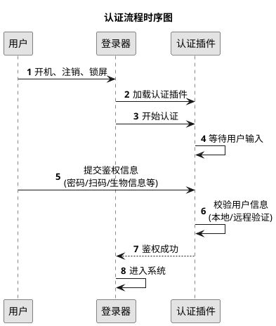
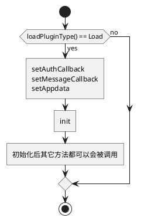

# 版本变更记录

| 版本  | 修订说明 | 修订人 | 修订时间   |
|:------|:---------|:-------|:-----------|
| V1.0  | 首次提交 | 殷杰   | 2022-05-17 |
| V1.1  | 1. 认证插件版本号更新为 2.0.0<br>2. 增加基于 JSON 数据的双向通讯方式<br>3. 认证插件可以自定义登录器的显示内容 | 殷杰 | 2022-05-17 |
| V1.2  | 补充缺失的接口函数和消息协议，优化文档格式和内容 | 殷杰 | 2023-07-22 |

# 概述

本文档是针对 UOS 登录器插件的开发指南，旨在指导开发人员如何在 UOS 登录器上增加自定义认证方式。插件必须基于 Qt 框架进行开发。

**适用读者：**
- 产品经理
- 设计人员
- 开发人员
- 测试人员

# 认证插件功能介绍

UOS 系统内置了多种登录认证方式：
- 密码认证
- UKey 认证
- 指纹识别
- 人脸识别
- 虹膜识别

这些认证方式都是在登录器内部实现的。如果需要添加新的认证方式（如二维码登录），又不想与 UOS 登录器代码产生强耦合，可以通过开发认证插件来实现。只需开发一个符合接口规范的动态库，即可为登录器增加新的认证方式，无需修改 UOS 登录器的源代码。

## 认证流程

认证插件的工作流程如下：

1. **插件加载**：登录器在开机/注销/锁屏时加载认证插件
2. **等待输入**：插件等待用户提供认证信息
3. **验证处理**：插件验证用户提供的信息
4. **结果返回**：将认证结果返回给登录器
5. **完成退出**：登录器处理后续的系统登录流程

插件只需专注于认证逻辑，无需关心系统登录的具体实现。



## 术语说明

登录器：即 UOS 系统中的登录/锁屏软件。

登录界面：是指用户开机、重启、注销后看到的 UI 界面，进程名称为 lightdm-deepin-greeter。

锁屏界面：是用户按下 Meta+L 快捷键（没有修改快捷键的情况下），或者在电源界面选择"锁定"后看到的 UI 界面，进程名为 dde-lock。

登录界面和锁屏界面是两个不同的进程，UI界面非常相似，但是功能和认证流程有很大的区别，在开发和调试的时候需要区分清楚。通过UI界面的`解锁按钮`可以轻松区分：登录界面解锁按钮是`箭头`图标，锁屏界面解锁按钮是`锁型`图标。

# 接口使用

## 开发环境配置

### 必需组件

1. **开发包安装**
   ```bash
   sudo apt install dde-session-shell-dev  # 版本要求 ≥ 5.5.18
   ```

### 头文件说明

安装完成后，在 `/usr/include/dde-session-shell/` 目录下会有几个关键头文件：
- `base_module_interface.h`：基础接口定义
- `login_module_interface.h`：登录相关接口定义
- `login_module_interface_v2.h`：登录相关接口定义（2.x.x版本）

> **注意**：开发时只需包含 `login_module_interface_v2.h` 即可，它已经包含了基础接口的定义。

## 数据结构参考

本节介绍认证插件开发中使用的核心数据结构。

### 插件类型相关

#### ModuleType

**说明：** 定义插件的基本类型和功能范围

**类型：** 枚举

**使用场景：** 在插件初始化时指定类型

| 字段 | 值 | 说明 | 使用建议 |
|:-----|:---|:-----|:---------|
| LoginType | 0 | 标准认证插件 | 🟢 默认推荐，适用于大多数认证场景 |
| TrayType | 1 | 托盘插件 | ⚪ 认证插件无需关注 |
| FullManagedLoginType | 2 | 全托管插件 | 🟡 需要完全控制登录流程时使用 |
| IpcAssistLoginType | 3 | IPC辅助登录插件 | 🟡 用于厂商密码插件集成 |
| PasswordExtendLoginType | 4 | 密码扩展插件 | 🟡 需要双重认证时使用 |

> **注意**：除非有特殊需求，默认使用 `LoginType`。其他类型建议先与 UOS 开发团队确认。

### 认证数据相关

#### AuthCallbackData

**说明：** 认证结果回传数据结构
**类型：** 结构体
**使用场景：** 在认证完成时向登录器返回结果

| 字段 | 类型 | 必填 | 说明 | 示例值 |
|:-----|:-----|:-----|:-----|:-------|
| result | int | 是 | 认证结果 | 1: 成功<br>其他: 失败 |
| account | string | 是 | 用户账号 | "user123" |
| token | string | 否 | 认证凭据 | "password123" |
| message | string | 否 | 提示信息 | "认证成功" |
| json | string | 否 | 预留的扩展数据字段，暂未使用 |  |

> **安全提示**：
> - 认证失败时应该在message中提供友好的错误提示
> - 避免在message中包含敏感信息，该字段会在日志中打印出来

#### AuthResult

**说明：** 认证结果状态码
**类型：** 枚举
**使用场景：** 在 `AuthCallbackData` 的 result 字段中使用

| 状态码 | 值 | 说明 | 使用场景 |
|:-------|:---|:-----|:---------|
| None | 0 | 未知状态 | 初始化或异常情况 |
| Success | 1 | 认证成功 | 用户验证通过 |
| Failure | 2 | 认证失败 | 验证不通过或发生错误 |

> **最佳实践**：
> - 推荐使用头文件中提供的枚举，而不是直接使用数字

#### CustomLoginType

**说明：** 自定义登录方式类型
**类型：** 枚举
**使用场景：** 指定插件提供的登录方式类型

| 类型 | 值 | 说明 | 适用场景 |
|:-----|:---|:-----|:---------|
| CLT_Default | 0 | 标准登录 | 🟢 单一认证方式 |
| CLT_MFA | 1 | 多因子认证 | 🟡 需要多重验证 |
| CLT_ThirdParty | 2 | 第三方认证 | 🟡 外部认证服务 |


### 回调函数相关

#### LoginCallBack

**说明：** 登录器提供的回调函数集合
**类型：** 结构体
**使用场景：** 插件与登录器之间的双向通信

| 字段 | 类型 | 说明 | 使用方式 |
|:-----|:-----|:-----|:---------|
| app_data | void* | 登录器上下文 | 仅作为回调参数传递，不要修改 |
| authCallbackFun | AuthCallbackFun | 认证结果回调 | 用于返回认证结果 |
| messageCallbackFunc | MessageCallbackFun | 消息通信回调 | 用于主动发送消息给登录器 |

> **使用说明**：
> - 保存函数指针的变量必须初始化为空，并在使用指针前进行判空，避免使用空指针或野指针。

### 应用类型相关

#### AppType

**说明：** 认证发起方的类型标识
**类型：** 枚举
**使用场景：** 区分认证请求来源，采用不同的认证策略

| 类型 | 值 | 说明 | 进程信息 | 特点 |
|:-----|:---|:-----|:---------|:-----|
| None | 0 | 异常状态 | - | 表示初始化失败或配置错误 |
| Login | 1 | 登录界面 | `/usr/bin/lightdm-deepin-greeter` | 和lightdm配合有标准化的登录流程 |
| Lock | 2 | 锁屏界面 | `/usr/bin/dde-lock` | 认证完成后隐藏界面，仅此而已 |

> **处理建议**：
> - 如果在登录界面和锁屏界面有不同的业务逻辑，可以通过这个变量来判断。

#### LoadType

**说明：** 插件加载控制标识
**类型：** 枚举
**使用场景：** 控制插件是否被登录器加载

| 标识 | 值 | 说明 | 使用场景 |
|:-----|:---|:-----|:---------|
| Load | 0 | 允许加载 | 默认值 |
| Notload | 1 | 禁止加载 | 插件根据自身的业务逻辑不想进行认证，例如：<br>- 系统环境不支持<br>- 依赖服务未启动<br>- 配置文件缺失<br>- 业务需求等 |

> **最佳实践**：
> - 在插件构造时检查运行环境
> - 插件应记录不加载的原因

### 认证框架相关

#### AuthObjectType

**说明：** 认证服务提供方类型
**类型：** 枚举
**使用场景：** 识别当前使用的认证框架，一般认证插件无需关注

| 框架类型 | 值 | 说明 |
|:---------|:---|:-----|
| LightDM | 0 | 显示管理器 |
| DeepinAuthenticate | 1 | 深度认证框架 |


### 认证方式相关

#### AuthType

**说明：** 系统支持的认证方式
**类型：** 枚举（位掩码）
**使用场景：** 指定认证方式或组合多种认证方式

| 类型 | 值 | 说明 |
|:-----|:---|:-----|
| AT_None | 0 | 未指定 |
| AT_Password | 1<<0 | 密码认证 |
| AT_Fingerprint | 1<<1 | 指纹识别 |
| AT_Face | 1<<2 | 人脸识别 |
| AT_ActiveDirectory | 1<<3 | AD域认证 |
| AT_Ukey | 1<<4 | UKey认证 |
| AT_FingerVein | 1<<5 | 指静脉识别 |
| AT_Iris | 1<<6 | 虹膜识别 |
| AT_Passkey | 1<<7 | 安全密钥 |
| AT_Pattern | 1<<8 | 图案解锁 |
| AT_PAM | 1<<29 | PAM认证 |
| AT_Custom | 1<<30 | 自定义认证 |
| AT_All | -1 | 支持所有方式 |

> **使用说明**：
> - 可以通过位运算组合多种认证方式，例如：`AT_Password | AT_Fingerprint` 表示同时支持密码和指纹
> - 插件的认证方式是 `AT_Custom`。

#### AuthState

**说明：** 认证过程的状态标识
**类型：** 枚举
**使用场景：** 跟踪和管理认证流程的各个状态

| 字段 | 值  | 说明       | 备注                                                                                |
| :--- | :-- | :--------- | :---------------------------------------------------------------------------------- |
| AS_None       | -1  | 默认       |                                                                                     |
| AS_Success    | 0   | 成功       | 此次认证的最终结果                                                                  |
| AS_Failure    | 1   | 失败       | 此次认证的最终结果                                                                  |
| AS_Cancel     | 2   | 取消       | 当认证没有给出最终结果时，调用 End 会出发 Cancel 信号                               |
| AS_Timeout    | 3   | 超时       | 一些认证设备会有超时状态的设定                                                      |
| AS_Error      | 4   | 错误       |                                                                                     |
| AS_Verify     | 5   | 验证中     |                                                                                     |
| AS_Exception  | 6   | 设备异常   | 当前认证会被 End                                                                    |
| AS_Prompt     | 7   | 设备提示   |                                                                                     |
| AS_Started    | 8   | 认证已启动 | 调用 Start 之后，每种成功开启都会发送此信号                                         |
| AS_Ended      | 9   | 认证已结束 | 调用 End 之后，每种成功关闭的都会发送此信号，当某种认证类型被锁定时，也会触发此信号 |
| AS_Locked     | 10  | 认证已锁定 | 认证类型已锁定，表示认证类型不可用（从安全角度考虑，失败次数过多时会导致这种情况）  |
| AS_Recover    | 11  | 设备恢复   | 需要调用 Start 重新开启认证，对应 AS_Exception                                      |
| AS_Unlocked   | 12  | 认证解锁   | 认证类型解除锁定，表示可以继续继续使用此认证类型开始认证了                          |
| AS_Unknown    | 13  | 未知状态   |                                                                                     |
| AS_VerifyCode | 14  | 需要验证码 |                                                                                     |

### 认证级别相关

#### DefaultAuthLevel

**说明：** 认证方式的优先级设置
**类型：** 枚举
**使用场景：** 配置默认的认证方式选择策略

| 级别 | 值 | 策略 | 使用建议 |
|:-----|:---|:-----|:---------|
| NoDefault | 0 | 智能选择 | 🟢 推荐使用<br>- 优先使用上次成功的认证方式<br>- 无历史记录时按系统默认顺序 |
| Default | 1 | 已废弃 | ⛔ 不要使用<br>- 保留向后兼容<br>- 功能与 NoDefault 类似 |
| StrongDefault | 2 | 强制插件 | 🟡 特殊场景<br>- 始终优先使用插件认证<br> |

> **选择建议**：
> - 一般情况使用 `NoDefault`，提供更好的用户体验
> - 需要强制使用插件认证时，使用 `StrongDefault`
> - 避免使用已废弃的 `Default` 级别

## 接口说明

在开发认证插件时需要以 public 方式继承LoginModuleInterfaceV2，并实现以下接口。

### BaseModuleInterface

#### type

**函数定义：**

```c++
virtual ModuleType type() const = 0
```

**说明：** 插件的类型。

**入参：** 无

**返回值：**

| 类型       | 说明       | 备注                       |
| :--------- | :--------- | :------------------------- |
| ModuleType | 插件的类型 | 认证插件必须返回 LoginType |

**必须实现：** 否；LoginModuleInterface 已经实现了这个函数，默认返回 LoginType。

#### init

**函数定义：**

```c++
virtual void init() = 0
```

**说明：**
1. 插件加载是在子线程进行的，界面相关的初始化操作放在这个函数中，不要放在构造函数里处理。
2. 这个方法在主线程中调用，不要进行耗时操作，耗时操作请异步处理。
3. 这个函数可能会重复调用，以重置界面内容。

**入参：** 无

**返回值：** 无

**必须实现：** 是

#### key

**函数定义：**

```c++
virtual QString key() const = 0
```

**说明：** 唯一值，用于与其它模块区分。

**入参：** 无

**返回值：**

| 类型   | 说明     | 备注                     |
| :----- | :------- | :----------------------- |
| string | 唯一编码 | 传入与项目相关的命名即可，切记要带有独特性（比如公司、项目缩写），避免和其它插件重名 |

**必须实现：** 是

#### icon

**函数定义：**

```c++
virtual QString icon() const
```

**说明：**
当认证因子不止一种时，登录器会显示认证类型切换组件，它是由一个按钮组（Button Group）组成的，此函数返回的图标会展示在"认证插件切换按钮"上面。

**入参：** 无

**返回值：**


| 类型   | 说明           | 备注                                                                                                                                         |
| :----- | :------------- | :------------------------------------------------------------------------------------------------------------------------------------------- |
| string | 认证插件的图标 | - 使用图标的绝对路径（加载方式为 QIcon("absolute path")）<br>- 使用系统图标的名称(加载方式为 QIcon::fromTheme("system icon name"))。 |

**必须实现：** 否

#### content

**函数定义：**

```c++
virtual QWidget* content() const = 0
```

**说明：**
登录器会将返回的 QWidget* 内容展示出来，可以展示提示信息或者二维码等，具体内容插件可以自由设计。需要注意的是，登录器的展示的版面有限，高度最好不要超过 500 像素，宽度不超过 900 像素。

**入参：** 无

**返回值：**

| 类型      | 说明                   | 备注                               |
| :-------- | :--------------------- | :--------------------------------- |
| QWidget\* | 插件想要显示的窗口指针 | 由登录器托管，插件不要释放这个指针 |

**必须实现：** 是

#### loadPluginType

**函数定义：**

```c++
virtual LoadType loadPluginType() const
```

**说明：**
登录器在加载插件的时候会调用这个接口，如果返回 Load，那么登录会加载插件，返回其它则不会加载插件。 非全平台或全架构的插件需要重新实现这个接口，根据实际情况处理。

**入参：** 无

**返回值：**

| 类型     | 说明                  | 备注 |
| :------- | :-------------------- | :--- |
| LoadType | 见 `LoadType`的说明 | -    |

**必须实现：** 是

#### setAppData

**函数定义：**

```c++
virtual void setAppData(void*) const
```

**说明：**
设置登录器的回调指针，插件需要保存指针，在使用回调函数的时候回传给登录器。如果要使用回调函数，则必须实现此函数。函数可能会被重复调用，插件回传最后一次设置的即可。

**入参：**

| 类型   | 说明                 | 备注 |
| :----- | :------------------- | :--- |
| void\* | 登录器的回调指针     | -    |

**返回值：** 无

**必须实现：** 否

#### setMessageCallback

**函数定义：**

```c++
virtual void setMessageCallback(MessageCallbackFunc *) = 0
```

**说明：** 设置回调函数，会在init函数之前调用。

**入参：**

| 类型                  | 说明                                 | 备注 |
| :-------------------- | :----------------------------------- | :--- |
| MessageCallbackFunc\* | 详见 `MessageCallbackFunc`类型说明 |      |

**返回值：** 无

**必须实现：** 否

#### MessageCallbackFun

**函数定义：**

```c++
QString (*)(const QString &, void *)
```

**说明：**
消息回调函数，用于向登录器发起通讯的场景

**入参：**

| 类型   | 说明                              | 备注                                    |
| :----- | :-------------------------------- | :-------------------------------------- |
| string | 发送给登录器的 JSON 格式数据      | JSON 数据的具体内容详见 "JSON 数据协议" 部分 |
| void\* | 即 LoginCallBack 的 app_data 字段 |                                         |

**返回值：**

| 类型   | 说明                         | 备注 |
| :----- | :--------------------------- | :--- |
| string | 登录器返回的 JSON 格式数据 |      |


### LoginModuleInterfaceV2

#### message

**函数定义：**

```c++
virtual QString message(const QString &)
```

**说明：**
登录器主动向认证插件发起通讯，用于获取插件信息或者给插件提供信息。**这是插件与登录器交互的核心方法**，插件通过处理不同的 JSON 消息来实现各种功能。具体的 JSON 协议格式请参考本文档的 "JSON 数据协议" 部分。

**入参：**

| 类型    | 说明            | 备注 |
| :------ | :-------------- | :--- |
| QString | json 格式字符串 | 包含CmdType等字段的JSON消息 |

**返回值：**

| 类型    | 说明            | 备注 |
| :------ | :-------------- | :--- |
| QString | json 格式字符串 | 插件的响应数据 |

**必须实现：** 否

**实现示例：**

```c++
QString YourPlugin::message(const QString &jsonStr) {
    QJsonDocument doc = QJsonDocument::fromJson(jsonStr.toUtf8());
    QJsonObject obj = doc.object();
    QString cmdType = obj["CmdType"].toString();

    if (cmdType == "IsPluginEnabled") {
        QJsonObject response;
        response["Code"] = 0;
        response["Message"] = "Success";
        QJsonObject data;
        data["IsPluginEnabled"] = true; // 插件是否启用
        response["Data"] = data;
        return QJsonDocument(response).toJson();
    } else if (cmdType == "GetConfigs") {
        // 处理获取配置的请求
        QJsonObject response;
        response["Code"] = 0;
        response["Message"] = "Success";
        QJsonObject data;
        data["ShowAvatar"] = true;
        data["ShowUserName"] = true;
        data["DefaultAuthLevel"] = 1;
        response["Data"] = data;
        return QJsonDocument(response).toJson();
    }
    // 处理其他命令...

    return "{}"; // 默认返回空JSON对象
}
```


**必须实现：** 否

#### setAuthCallback

**函数定义：**

```c++
virtual void setAuthCallback(AuthCallbackFunc *) = 0
```

**说明：** 设置认证结果回调函数，会在init函数之前调用。

**入参：**

| 类型               | 说明                              | 备注 |
| :----------------- | :-------------------------------- | :--- |
| AuthCallbackFunc\* | 详见 `AuthCallbackFunc`类型说明 |      |

**返回值：** 无

**必须实现：** 是

#### AuthCallbackFun

**函数定义：**

```c++
void (*)(const AuthCallbackData *, void *)
```

**说明：** 认证回调函数，用于插件返回认证的状态、结果等

**入参：**

| 类型               | 说明                              | 备注 |
| :----------------- | :-------------------------------- | :--- |
| AuthCallbackData\* | 认证相关信息                      |      |
| void\*             | 即 LoginCallBack 的 app_data 字段 |      |

**返回值：** 无

#### reset

**函数定义：**

```c++
virtual void reset() = 0
```

**说明：**
插件需要在这个方法中重置UI和验证状态，通常验证开始之前登录器会调用这个方法，但是不保证每次验证前都会调用。插件必须实现这个函数，并在函数内重置之前的验证结果，避免将以前的结果应用在当前认证中。

**入参：** 无

**返回值：** 无

**必须实现：** 是

### 初始化接口调用

认证插件初始化时接口调用顺序如下：



## JSON 数据协议

插件与登录器之间通过 JSON 格式进行消息交互。这些协议在 `message()` 方法和 `messageCallback()` 函数中使用。

### 指令方向说明

- **登录器→插件**：登录器主动发送给插件的协议（插件在 `message()` 方法中处理）
- **插件→登录器**：插件主动发送给登录器的协议（插件通过 `messageCallback()` 函数发送）

### 默认响应格式

| 字段    | 类型   | 说明             |
| :------ | :----- | :--------------- |
| Code    | int    | 0 成功，其他失败 |
| Message | string | 提示消息         |

示例：

```json
{
  "Code": 0,
  "Message": "Success"
}
```

### 🔴 核心协议

核心协议是认证插件必须关注的基础通信协议，确保插件能够正常集成到登录系统中。

#### IsPluginEnabled（登录器 ⟶ 插件）

登录器查询插件是否启用。

**请求：**

| 字段    | 类型   | 值                | 说明 |
| :------ | :----- | :---------------- | :--- |
| CmdType | string | "IsPluginEnabled" |  插件没有实现则默认为ture   |

**响应：**

| 字段                 | 类型   | 必填项 | 说明             |
| :------------------- | :----- | :----- | :--------------- |
| Code                 | int    | 否     | 0 成功，其他失败 |
| Message              | string | 否     | 提示消息         |
| Data                 | object | 是     |                  |
| Data.IsPluginEnabled | bool   | 是     | 默认为 true      |

**示例：**

```json
// 请求
{
  "CmdType": "IsPluginEnabled"
}

// 响应
{
  "Code": 0,
  "Message": "Success",
  "Data": {
    "IsPluginEnabled": true
  }
}
```

#### GetConfigs（登录器 ⟶ 插件）

登录器获取插件的UI控制配置。

**请求：**

| 字段    | 类型   | 值           | 说明 |
| :------ | :----- | :----------- | :--- |
| CmdType | string | "GetConfigs" |      |

**响应：**

| 字段                    | 类型   | 必填项 | 说明                                                         |
| :---------------------- | :----- | :----- | :----------------------------------------------------------- |
| Code                    | int    | 否     | 0 成功，其他失败                                             |
| Message                 | string | 否     | 提示消息                                                     |
| Data                    | object | 是     |                                                              |
| Data.ShowAvatar         | bool   | 否     | 是否显示用户头像                                             |
| Data.ShowUserName       | bool   | 否     | 是否显示用户名                                               |
| Data.ShowSwitchButton   | bool   | 否     | 是否显示认证类型切换按钮                                     |
| Data.ShowLockButton     | bool   | 否     | 是否显示解锁按钮                                             |
| Data.DefaultAuthLevel   | int    | 否     | 见`DefaultAuthLevel`枚举说明                                |
| Data.SupportDefaultUser | bool   | 否     | 是否支持默认用户登录                                         |

**示例：**

```json
// 请求
{
  "CmdType": "GetConfigs"
}

// 响应
{
  "Code": 0,
  "Message": "Success",
  "Data": {
    "ShowAvatar": true,
    "ShowUserName": true,
    "ShowSwitchButton": true,
    "ShowLockButton": false,
    "DefaultAuthLevel": 1
  }
}
```

#### CurrentUserChanged（用户变化通知）

登录器通知插件当前用户发生变化。

**请求：**

| 字段      | 类型   | 值                 | 说明               |
| :-------- | :----- | :----------------- | :----------------- |
| CmdType   | string | CurrentUserChanged |                    |
| Data      | object | -                  |                    |
| Data.Name | string | -                  | 当前用户的用户名   |
| Data.Uid  | int    | -                  | 当前用户的ID       |

**响应：** 默认响应格式

**示例：**

```json
// 请求
{
  "CmdType": "CurrentUserChanged",
  "Data": {
    "Name": "uos",
    "Uid": 1001
  }
}
```

#### SetAuthTypeInfo（设置认证类型信息）

插件向登录器发送认证类型相关信息。

**请求：**

| 字段 | 类型 | 值 | 说明 |
|:-----|:-----|:---|:-----|
| CmdType | string | "setAuthTypeInfo" | ⚠️ 这里首字母是小写（历史原因） |
| Data | object | - | |
| Data.AuthType | int | - | 见 `AuthType` 枚举说明 |

**示例：**

```json
// 请求
{
  "CmdType": "SetAuthTypeInfo",
  "Data": {
    "AuthType": 1
  }
}
```


### 🟡 扩展协议

扩展协议提供额外的功能特性，开发者可根据实际需求选择性实现，用于增强插件的功能表现。

#### GetProperties（登录器 ⟶ 插件）

登录器获取系统属性信息。

**请求：**

| 字段    | 类型   | 值                        | 说明                                                         |
| :------ | :----- | :------------------------ | :----------------------------------------------------------- |
| CmdType | string | "GetProperties"           |                                                              |
| Data    | array  | ["AppType","CurrentUser"] | 支持的属性列表，API 2.0.0+ 支持 "AppType", "CurrentUser"   |

**响应：**

| 字段                  | 类型   | 说明                  |
| :-------------------- | :----- | :-------------------- |
| Code                  | int    | 0 成功，其他失败      |
| Message               | string | 提示消息              |
| Data                  | object | -                     |
| Data.AppType          | int    | 详见 AppType 枚举说明 |
| Data.CurrentUser      | object | 当前用户信息          |
| Data.CurrentUser.Name | string | 当前用户的用户名      |
| Data.CurrentUser.Uid  | int    | 当前用户的ID          |

#### StartAuth（登录器 ⟶ 插件）

登录器通知插件开始认证。

**请求：**

| 字段                | 类型   | 值        | 说明                        |
| :------------------ | :----- | :-------- | :-------------------------- |
| CmdType             | string | StartAuth |                             |
| Data                | object |           |                             |
| Data.AuthObjectType | int    |           | 见 `AuthObjectType`的说明 |

**响应：** 默认响应格式

#### AuthState（登录器 ⟶ 插件）

登录器发送当前认证状态。

**请求：**

| 字段           | 类型   | 值          | 说明                     |
| :------------- | :----- | :---------- | :----------------------- |
| CmdType        | string | "AuthState" |                          |
| Data           | object |             |                          |
| Data.AuthType  | int    |             | 见 `AuthType`的说明    |
| Data.AuthState | int    |             | 见 `AuthState`的说明   |

**响应：** 默认响应格式

#### LimitsInfo（登录器 ⟶ 插件）

登录器发送认证限制信息。

**请求：**

| 字段               | 类型   | 值           | 说明                      |
| :----------------- | :----- | :----------- | :------------------------ |
| CmdType            | string | "LimitsInfo" |                           |
| Data               | array  |              |                           |
| Object.Flag        | int    |              | 认证类型，见 `AuthType` |
| Object.Locked      | bool   |              | 是否锁定                  |
| Object.MaxTries    | int    |              | 可尝试的次数              |
| Object.NumFailures | int    |              | 已错误次数                |
| Object.UnlockSecs  | int    |              | 还剩多久解锁              |
| Object.UnlockTime  | string |              | 解锁时间                  |

**响应：** 默认响应格式

#### AccountError（登录器 ⟶ 插件）

登录器通知插件账户验证出现错误。

**请求：**

| 字段    | 类型   | 值             | 说明                                                |
| :------ | :----- | :------------- | :------------------------------------------------- |
| CmdType | string | "AccountError" | 当账户信息错误的时候会发出这个信息，比如用户不存在，用户密码过期等 |

**响应：** 默认响应格式

#### AuthFactorsChanged（登录器 ⟶ 插件）

登录器通知插件认证因子发生变化。

**请求：**

| 字段    | 类型   | 值                  | 说明     |
| :------ | :----- | :------------------ | :------- |
| CmdType | string | "AuthFactorsChanged" |          |
| Data    | int    |                     | 认证因子 |

**响应：** 默认响应格式

#### ReadyToAuthChanged（插件 ⟶ 登录器）

插件通知登录器认证准备状态发生变化。

**发送方式：** 插件通过 `messageCallback()` 发送

**请求：**

| 字段    | 类型   | 值                   | 说明         |
| :------ | :----- | :------------------- | :----------- |
| CmdType | string | "ReadyToAuthChanged" |              |
| Data    | bool   |                      | 是否准备就绪 |

**响应：** 默认响应格式

#### ReadyToAuth（登录器 ⟶ 插件）

登录器查询插件是否准备好进行认证。

**请求：**

| 字段    | 类型   | 值           | 说明 |
| :------ | :----- | :----------- | :--- |
| CmdType | string | "ReadyToAuth" |     |

**响应：**

| 字段             | 类型   | 必填项 | 说明                         |
| :--------------- | :----- | :----- | :--------------------------- |
| Code             | int    | 否     | 0 成功，其他失败             |
| Message          | string | 否     | 提示消息                     |
| Data             | object | 是     |                              |
| Data.ReadyToAuth | bool   | 是     | 是否准备好认证，默认true     |

### ⚪ 特殊协议

特殊协议专门用于处理复杂业务场景和特殊需求，适用于特殊定制化开发，按需实现。

#### GetLevel（登录器 ⟶ 插件）

用于多层级认证场景。

**请求：**

| 字段    | 类型   | 值        | 说明 |
| :------ | :----- | :-------- | :--- |
| CmdType | string | "GetLevel" |     |

**响应：**

| 字段       | 类型   | 必填项 | 说明                 |
| :--------- | :----- | :----- | :------------------- |
| Code       | int    | 否     | 0 成功，其他失败     |
| Message    | string | 否     | 提示消息             |
| Data       | object | 是     |                      |
| Data.Level | int    | 是     | 插件层级，默认为1    |

#### GetLoginType（登录器 ⟶ 插件）

获取插件的登录类型。

**请求：**

| 字段    | 类型   | 值            | 说明 |
| :------ | :----- | :------------ | :--- |
| CmdType | string | "GetLoginType" |      |

**响应：**

| 字段           | 类型   | 必填项 | 说明                                 |
| :------------- | :----- | :----- | :----------------------------------- |
| Code           | int    | 否     | 0 成功，其他失败                     |
| Message        | string | 否     | 提示消息                             |
| Data           | object | 是     |                                      |
| Data.LoginType | int    | 是     | 登录类型，见`CustomLoginType`       |

#### HasSecondLevel（登录器 ⟶ 插件）

检查指定用户是否需要第二层认证。

**请求：**

| 字段    | 类型   | 值              | 说明     |
| :------ | :----- | :-------------- | :------- |
| CmdType | string | "HasSecondLevel" |          |
| Data    | string |                 | 用户名   |

**响应：**

| 字段                | 类型   | 必填项 | 说明                 |
| :------------------ | :----- | :----- | :------------------- |
| Code                | int    | 否     | 0 成功，其他失败     |
| Message             | string | 否     | 提示消息             |
| Data                | object | 是     |                      |
| Data.HasSecondLevel | bool   | 是     | 是否需要二层认证     |

#### GetSessionTimeout（登录器 ⟶ 插件）

获取插件自定义的会话超时时长。

**请求：**

| 字段    | 类型   | 值                 | 说明 |
| :------ | :----- | :----------------- | :--- |
| CmdType | string | "GetSessionTimeout" |      |

**响应：**

| 字段                | 类型   | 必填项 | 说明                             |
| :------------------ | :----- | :----- | :------------------------------- |
| Code                | int    | 否     | 0 成功，其他失败                 |
| Message             | string | 否     | 提示消息                         |
| Data                | object | 是     |                                  |
| Data.SessionTimeout | int    | 是     | 会话超时时长(毫秒)，默认15000    |

#### UpdateLoginType（登录器 ⟶ 插件）

通知插件更新登录类型，登录类型信息依赖远程配置。

**请求：**

| 字段    | 类型   | 值               | 说明 |
| :------ | :----- | :--------------- | :--- |
| CmdType | string | "UpdateLoginType" |      |

**响应：**

| 字段           | 类型   | 必填项 | 说明                 |
| :------------- | :----- | :----- | :------------------- |
| Code           | int    | 否     | 0 成功，其他失败     |
| Message        | string | 否     | 提示消息             |
| Data           | object | 是     |                      |
| Data.LoginType | int    | 是     | 更新后的登录类型     |

## 编程实例

### CMakeLists.txt

```cmake
# 设置运行此配置所需的 cmake 的最低版本
cmake_minimum_required(VERSION 3.11)

# 使用 set 命令设置一个变量
set(PLUGIN_NAME login-basic)

# 设置项目名称
project(${PLUGIN_NAME})

# 启用 qt moc 的支持
set(CMAKE_AUTOMOC ON)
# 启用 qrc 资源文件的支持
set(CMAKE_AUTORCC ON)

# 指定所有源码文件
# 使用了 cmake 的 file 命令，递归查找项目目录下所有头文件和源码文件
# 并将结果放入 SRCS 变量中，方便后续取用
file(GLOB_RECURSE SRCS "*.h" "*.cpp")

# 指定要用到的库
# 使用了 cmake 的 find_package 命令，查找库 Qt5Widgets 等，
# REQUIRED 参数表示如果没有找到则报错
# find_package 命令在找到并加载指定的库之后会设置一些变量
# 常用的有：
# <库名>_FOUND          是否找到（Qt5Widgets_FOUND）
# <库名>_DIR            在哪个目录下找到的（Qt5Widgets_DIR）
# <库名>_INCLUDE_DIRS   有哪些头文件目录（Qt5Widgets_INCLUDE_DIRS）
# <库名>_LIBRARIES      有哪些库文件（Qt5Widgets_LIBRARIES）
find_package(Qt5Widgets REQUIRED)
find_package(DtkWidget REQUIRED)
find_package(DdeSessionShell REQUIRED)

# find_package 命令还可以用来加载 cmake 的功能模块
# 并不是所有的库都直接支持 cmake 查找的，但大部分都支持了 pkg-config 这个标准，
# 因此 cmake 提供了间接加载库的模块：FindPkgConfig， 下面这行命令表示加载 FindPkgConfig 模块，
# 这个 cmake 模块提供了额外的基于 "pkg-config" 加载库的能力
# 执行下面的命令后会设置如下变量，不过一般用不到：
# PKG_CONFIG_FOUND            pkg-config 可执行文件是否找到了
# PKG_CONFIG_EXECUTABLE       pkg-config 可执行文件的路径
# PKG_CONFIG_VERSION_STRING   pkg-config 的版本信息
find_package(PkgConfig REQUIRED)

# add_definitions 命令用于声明/定义一些编译/预处理参数
add_definitions("${QT_DEFINITIONS} -DQT_PLUGIN")

# 新增一个编译目标
# 这里使用命令 add_library 来表示本项目要生成一个库文件目标，
# 类似的还有命令 add_executable 添加一个可执行二进制目标，甚至 add_custom_target(使用较少) 添加自定义目标
# SHARED 表示生成的库应该是动态库，
# 变量 ${PLUGIN_NAME} 和 ${SRCS} 都是前面处理好的，
# 另外 qrc 资源文件也应该追加在后面以编译进目标中。
add_library(${PLUGIN_NAME} SHARED ${SRCS})

# 设置目标的生成位置，这里表示生成在执行 make 的目录,
# 另外还有很多可用于设置的属性，可查阅 cmake 文档。
set_target_properties(${PLUGIN_NAME} PROPERTIES LIBRARY_OUTPUT_DIRECTORY ./)

# 设置目标要使用的 include 目录，即头文件目录
# 变量 ${DtkWidget_INCLUDE_DIRS} 是在前面执行 find_package 命令时引入的
# 当出现编译失败提示找不到某些库的头文件时应该检查此处是否将所有需要的头文件都包含了
target_include_directories(${PLUGIN_NAME} PUBLIC
    ${Qt5Widgets_INCLUDE_DIRS}
    ${DtkWidget_INCLUDE_DIRS}
    ${DdeSessionShell_INCLUDE_DIRS}
)

# 设置目标要使用的链接库
# 变量 ${DtkWidget_LIBRARIES} 和 ${Qt5Widgets_LIBRARIES} 是在前面执行 find_package 命令时引入的
# 当出现运行时错误提示某些符号没有定义时应该检查此处是否将所有用的库都写在了这里
target_link_libraries(${PLUGIN_NAME} PRIVATE
    ${Qt5Widgets_LIBRARIES}
    ${DtkWidget_LIBRARIES}
    ${DdeSessionShell_LIBRARIES}
)

# 设置安装路径的前缀(默认为"/usr/local")
set(CMAKE_INSTALL_PREFIX "/usr")

# 设置执行 make install 时哪个目标应该被 install 到哪个位置
install(TARGETS ${PLUGIN_NAME} LIBRARY DESTINATION lib/dde-session-shell/modules)

```

### 头文件

```c++
#ifndef LOGIN_MODULE_H
#define LOGIN_MODULE_H

#include "login_module_interface_v2.h"

namespace dss {
namespace module_v2 {

class LoginModule : public QObject
    , public LoginModuleInterfaceV2
{
    Q_OBJECT
    Q_PLUGIN_METADATA(IID "com.deepin.dde.shell.Modules_v2.Login" FILE "login.json")
    Q_INTERFACES(dss::module_v2::LoginModuleInterfaceV2)

public:
    explicit LoginModule(QObject *parent = nullptr);
    ~LoginModule() override;

    void init() override;

    inline QString key() const override { return objectName(); }
    inline QWidget *content() override { return m_loginWidget; }
    void reset() override;
    void setAppData(AppDataPtr) override;
    void setAuthCallback(AuthCallbackFun) override;
    QString message(const QString &) override;

private:
    void initUI();

private:
    AppDataPtr m_appData;
    AuthCallbackFun m_authCallback;
    QWidget *m_loginWidget;
};

} // namespace module_v2
} // namespace dss
#endif // LOGIN_MODULE_H
```

### 源文件

```c++
#include "login_module.h"

#include <QBoxLayout>
#include <QWidget>
#include <QVBoxLayout>
#include <QPushButton>
#include <QDBusConnection>
#include <QDBusMessage>

namespace dss {
namespace module_v2 {

LoginModule::LoginModule(QObject *parent)
    : QObject(parent)
    , m_appData(nullptr)
    , m_authCallback(nullptr)
    , m_loginWidget(nullptr)
{
    setObjectName(QStringLiteral("LoginModule"));
}

LoginModule::~LoginModule()
{
    if (m_loginWidget) {
        delete m_loginWidget;
        m_loginWidget = nullptr;
    }
}

void LoginModule::init()
{
    initUI();
}

void LoginModule::reset()
{
    init();
}

void LoginModule::setAppData(AppDataPtr appData)
{
    m_appData = appData;
}

void LoginModule::setAuthCallback(AuthCallbackFun authCallback)
{
    m_authCallback = authCallback;
}

void LoginModule::initUI()
{
    if (m_loginWidget) {
        return;
    }
    m_loginWidget = new QWidget;
    m_loginWidget->setAccessibleName(QStringLiteral("LoginWidget"));
    m_loginWidget->setMinimumSize(260, 100);

    m_loginWidget->setLayout(new QHBoxLayout);
    QPushButton *passButton = new QPushButton("Validation passed", m_loginWidget);
    passButton->setFixedSize(160, 40);
    m_loginWidget->layout()->addWidget(passButton);

    connect(passButton, &QPushButton::clicked, this, [this] {
        AuthCallbackData data;
        data.account = "uos"; // 需要与当前的用户名匹配
        data.token = "1";
        data.result = AuthResult::Success;
        m_authCallback(&data, m_appData);
    }, Qt::DirectConnection);
}

} // namespace module
} // namespace dss
```

### 元数据文件

插件需要提供一个 JSON 格式的元数据文件，用于描述插件的基本信息和兼容性要求。

**文件名：** `login.json`

**基本格式：**
```json
{
    "api": "2.0.0",
    "pluginType": "Login"
}
```

### 二进制路径

登录器会在启动时从 `/usr/lib/dde-session-shell/modules` 目录下加载后缀为 `.so` 的插件。在开发时需要在 `CMakeLists.txt` 或 `.pro` 文件中设置插件的安装路径为 `/usr/lib/dde-session-shell/modules`。

# 安全性

在整个流程中，登录器不参与用户身份的校验，用户身份的真实性和访问权限完全由认证插件来保证。因此，在开发认证插件时对于安全性的考虑要全面且慎重。这是除了功能需求之外最重要的特性，下面列出一些常见的安全考量：

- 输入密码等认证信息必须使用加密手段防止数据被窃取和中间人攻击。
- 图形界面程序不应该将自己提权到 root 权限（含 capabilities）运行。
- 存储的用户数据（如密码与隐私数据）必须进行高强度加密保护。
- 未经用户明确授权，不得保存或传输用户数据。

# 可靠性

登录器会将插件加载到内存中。如果认证插件的质量不过关，出现指针错误、内存溢出、在 UI 线程做耗时操作等问题，可能导致登录器崩溃或卡死，进而导致用户无法正常进入系统。由于登录器是系统的门户，如果用户无法正常使用登录器就无法进入系统，这是一个致命性问题。因此，在开发时必须将可靠性作为重点考虑因素。

### API 版本兼容性

认证插件的工程需要增加一个 json 文件，用来描述当前插件适配的 api 版本，在代码中使用 Q_PLUGIN_METADATA 将 json 文件设置为 metadata 文件,例如：Q_PLUGIN_METADATA(IID "com.deepin.dde.shell.Login" FILE "login.json")。登录器在加载插件时会解析 JSON 文件中的内容，获取 API 版本号。
登录器会做到小版本向下兼容（1.x.x 版本都互相兼容），如果出现无法兼容的情况（比如增加了接口头文件的虚函数，导致二进制不兼容），此时会修改大版本号（比如从 1.x.x 变更到 2.x.x）。登录器会比对 API 版本号，如果低于可兼容的版本号，则不会加载插件，以保证登录器本身能够正常运行。JSON 文件示例：

```c++
{
    "api": "2.0.0"，
    "pluginType": "Login"
}
```

login_module_interface.h 中 API_VERSION 宏定义的字符串即为当前 API 的版本号，JSON 文件中 api 字段记录的版本号务必与 API_VERSION 保持一致。
